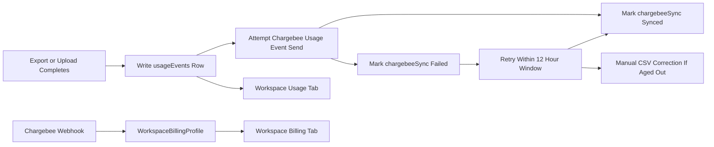

# Simplified Chargebee Billing Plan

## Scope

Update `/Users/amit/Downloads/Updated 3 Phased Plan.md` into a new three-phase plan that reflects the simplified model:

- Phase 1 remains the platform-operator control plane and should stay mostly unchanged.
- Phase 2 becomes internal usage capture, limits, freezes, and workspace usage UI only.
- Phase 3 becomes Chargebee linkage, mirrored billing profile data, live usage-event ingestion, and webhook updates.

## Architecture Direction




## Phase 1 Updates

Keep the existing Phase 1 content from `/Users/amit/Downloads/Updated 3 Phased Plan.md`:

- Platform-operator access remains `platform-admin` Cognito group plus active platform-admin registry plus active user row.
- Platform APIs continue to use platform-operator auth, not tenant auth.
- Audit behavior remains scoped to failures, workspace detail views, and mutations.
- No billing-specific complexity should be added to Phase 1.

## Phase 2 Rewrite

Replace the current Phase 2 snapshot/reconciliation-heavy wording with a smaller internal domain:

- Keep `usageEvents` as the internal usage ledger for exports and uploads.
- Keep a single workspace billing profile document. Prefer using the existing physical `billingAccounts` collection to avoid unnecessary migration churn, but describe the domain as `WorkspaceBillingProfile`.
- Store internal limits on that profile:
  - `limits.enabled`
  - `limits.enforcementMode: 'block' | 'overage'`
  - `limits.seats`
  - `limits.exports`
  - `limits.uploadMb` or `limits.uploadBytes`
  - `limits.ssoAllowed`
- Remove `usageSnapshots`, snapshot approval, snapshot recompute, reconciliation runs, and period-anchor correction from the plan.
- Keep internal limit enforcement because Chargebee cannot block app actions at export/upload/invite time.
- Keep active-seat enforcement locally against purchased/allowed seat count.
- Keep `usage freeze` and `access freeze` behavior if still wanted for platform-admin operations.
- Workspace admins can view usage and limits; decide later whether they can change `enforcementMode`, but default plan should make platform admin own limits.

Key backend areas to keep/adapt:

- `[/Users/amit/Developer/Startup/uprevit-backend/src/models/billing.ts](/Users/amit/Developer/Startup/uprevit-backend/src/models/billing.ts)`
- `[/Users/amit/Developer/Startup/uprevit-backend/src/utils/billing/usageRecording.ts](/Users/amit/Developer/Startup/uprevit-backend/src/utils/billing/usageRecording.ts)`
- `[/Users/amit/Developer/Startup/uprevit-backend/src/utils/billing/uploadCommit.ts](/Users/amit/Developer/Startup/uprevit-backend/src/utils/billing/uploadCommit.ts)`
- `[/Users/amit/Developer/Startup/uprevit-backend/src/utils/billing/enforcement.ts](/Users/amit/Developer/Startup/uprevit-backend/src/utils/billing/enforcement.ts)`
- `[/Users/amit/Developer/Startup/uprevit-backend/src/controllers/billing/getSummary.ts](/Users/amit/Developer/Startup/uprevit-backend/src/controllers/billing/getSummary.ts)`

Key Phase 2 removals from the plan:

- `UsageSnapshot`
- `USAGE_SNAPSHOTS_COLLECTION`
- `approvedForBillingAt`
- `approvedByPlatformAdminId`
- `reconciliationStatus`
- reconciliation-run APIs
- snapshot recompute APIs
- snapshot acceptance criteria

## Phase 3 Rewrite

Replace provider sync with live usage-event ingestion:

- Chargebee owns billing calculations, invoice generation, proration, subscription status, invoices, add-ons, and paid/unpaid state.
- Uprevit mirrors the important Chargebee data into the workspace billing profile for display and access decisions.
- Chargebee customer/subscription linking remains platform-admin-only.
- Seat increases/decreases are sent to Chargebee as subscription/add-on quantity changes and Chargebee handles proration.
- Seats are not usage events.
- Exports and uploads are Chargebee Usage Events.
- The app writes the local `usageEvents` row first, then attempts to send the Chargebee Usage Event in the same product flow.
- If Chargebee send fails, the usage event remains local with `chargebeeSync.status = 'failed'` or `pending` and retry metadata.
- A retry worker/manual trigger retries failed events inside the documented Usage Events timestamp window. The plan should state the stricter documented window is 12 hours, even if we previously assumed 24 hours.
- If an event ages out of the live ingestion window, mark it `manual_correction_required`; CSV/bulk upload is the operational fallback.

Suggested `usageEvents` sync fields:

```ts
type UsageEventChargebeeSync = {
  status: 'pending' | 'synced' | 'failed' | 'manual_correction_required';
  deduplicationId: string;
  attempts: number;
  lastAttemptAt?: Date;
  nextAttemptAt?: Date;
  syncedAt?: Date;
  lastError?: string;
};
```

Suggested workspace billing profile shape:

```ts
type WorkspaceBillingProfile = {
  workspaceId: ObjectId;
  status: 'draft' | 'active' | 'past_due' | 'cancelled' | 'sync_error';
  chargebee: {
    customerId?: string;
    subscriptionId?: string;
    subscriptionStatus?: string;
    planId?: string;
    planName?: string;
    billingCadence?: 'monthly' | 'yearly';
    currentTermStart?: Date;
    currentTermEnd?: Date;
    nextBillingAt?: Date;
    addOns: Array<{ id: string; name?: string; quantity?: number }>;
    invoices: Array<{ id: string; number?: string; status: string; amountDue?: number; amountPaid?: number; hostedUrl?: string; issuedAt?: Date }>;
    lastSyncedAt?: Date;
    lastSyncError?: string;
  };
  limits: {
    enabled: boolean;
    enforcementMode: 'block' | 'overage';
    seats: number;
    exports: number;
    uploadMb: number;
    ssoAllowed: boolean;
  };
  createdAt: Date;
  updatedAt: Date;
};
```

Key Phase 3 removals from the plan:

- `BillingProviderSyncOutbox`
- `BillingProviderEvent` as a user-visible/platform table
- `billingDocuments` as a separate collection, unless a later review insists on historical document persistence
- provider sync endpoint
- approve snapshot endpoint
- list provider events endpoint
- create quote flow, unless the product still wants sales-assisted quotes in v1
- provider sync UI and snapshot approval UI

Key backend areas to replace/remove:

- `[/Users/amit/Developer/Startup/uprevit-backend/src/utils/billing/chargebeeSync.ts](/Users/amit/Developer/Startup/uprevit-backend/src/utils/billing/chargebeeSync.ts)`
- `[/Users/amit/Developer/Startup/uprevit-backend/src/utils/billing/providerOutbox.ts](/Users/amit/Developer/Startup/uprevit-backend/src/utils/billing/providerOutbox.ts)`
- `[/Users/amit/Developer/Startup/uprevit-backend/src/utils/billing/snapshots.ts](/Users/amit/Developer/Startup/uprevit-backend/src/utils/billing/snapshots.ts)`
- `[/Users/amit/Developer/Startup/uprevit-backend/src/utils/billing/reconciliation.ts](/Users/amit/Developer/Startup/uprevit-backend/src/utils/billing/reconciliation.ts)`
- `[/Users/amit/Developer/Startup/uprevit-backend/src/controllers/platformAdmin/runProviderSync.ts](/Users/amit/Developer/Startup/uprevit-backend/src/controllers/platformAdmin/runProviderSync.ts)`
- `[/Users/amit/Developer/Startup/uprevit-backend/src/controllers/platformAdmin/approveUsageSnapshot.ts](/Users/amit/Developer/Startup/uprevit-backend/src/controllers/platformAdmin/approveUsageSnapshot.ts)`
- `[/Users/amit/Developer/Startup/uprevit-backend/src/controllers/platformAdmin/recomputeUsageSnapshot.ts](/Users/amit/Developer/Startup/uprevit-backend/src/controllers/platformAdmin/recomputeUsageSnapshot.ts)`
- `[/Users/amit/Developer/Startup/uprevit-backend/src/controllers/platformAdmin/runReconciliation.ts](/Users/amit/Developer/Startup/uprevit-backend/src/controllers/platformAdmin/runReconciliation.ts)`

## UI Plan

Update the plan so UI has two separate workspace settings tabs:

- `Usage` tab: internal usage this period, limits, enforcement status, over-limit warnings, freezes.
- `Billing` tab: mirrored Chargebee subscription data, plan, cadence, add-ons, current term, next billing date, invoices/payment status.

Remove from workspace `Usage` tab:

- Billing documents section.
- SSO add-on billing card if it is provider/billing data rather than internal usage.

Platform admin UI keeps:

- Workspace billing profile/linkage controls.
- Internal limits and freezes.
- Chargebee customer creation and subscription link.

Platform admin UI removes:

- Snapshot approval.
- Trigger provider sync.
- Recompute snapshot.
- Run reconciliation.
- Provider events table.

Key UI files to reflect in the plan:

- `[/Users/amit/Developer/Startup/uprevit-ui/apps/app/features/workspace/settings/UsageTab.tsx](/Users/amit/Developer/Startup/uprevit-ui/apps/app/features/workspace/settings/UsageTab.tsx)`
- `[/Users/amit/Developer/Startup/uprevit-ui/apps/app/app/(app)/settings/page.tsx](/Users/amit/Developer/Startup/uprevit-ui/apps/app/app/(app)`/settings/page.tsx)
- `[/Users/amit/Developer/Startup/uprevit-ui/apps/app/features/platform-admin/PlatformBillingSection.tsx](/Users/amit/Developer/Startup/uprevit-ui/apps/app/features/platform-admin/PlatformBillingSection.tsx)`
- `[/Users/amit/Developer/Startup/uprevit-ui/apps/app/features/platform-admin/PlatformChargebeeSection.tsx](/Users/amit/Developer/Startup/uprevit-ui/apps/app/features/platform-admin/PlatformChargebeeSection.tsx)`

## Acceptance Criteria For The Updated Plan

- The plan no longer asks us to sync approved snapshots to Chargebee.
- The plan no longer has reconciliation runs or snapshot approval workflows.
- Export completion creates one internal usage event and attempts one Chargebee Usage Event.
- Upload commit creates one internal usage event and attempts one Chargebee Usage Event.
- Failed Chargebee sends are visible on the usage event and retried inside the documented 12-hour window.
- Aged-out failed usage events become manual-correction items, with CSV/bulk import as fallback.
- Seats are represented as Chargebee subscription/add-on quantity, not metered usage.
- Workspace Usage and Billing tabs have separate responsibilities.
- Internal usage summary still works if Chargebee is down.
- Chargebee webhook failures do not block product usage, but they leave profile sync state visible.

## Verification Plan To Include

Backend:

```txt
npm --prefix src test -- billing
npm --prefix src test -- platformAdmin
npm --prefix src test -- chargebeeClient
npm --prefix src run type-check
```

UI:

```txt
bun run lint
bun run type-check
```

Manual E2E:

- Complete an export and confirm local usage event is recorded.
- Confirm the same export attempts Chargebee live ingestion.
- Simulate Chargebee failure and confirm retry metadata is stored on the usage event.
- Confirm failed event retry works before the 12-hour cutoff.
- Confirm aged-out failed events surface as manual correction required.
- Commit an upload and confirm internal and Chargebee usage paths.
- Link a Chargebee subscription and confirm Billing tab shows mirrored plan/add-on/invoice data.
- Change seat quantity in Chargebee or via platform-admin flow and confirm profile/limits mirror as expected.
- Confirm block mode blocks exports/uploads/seats at limits.
- Confirm overage mode allows usage and sends events to Chargebee.

