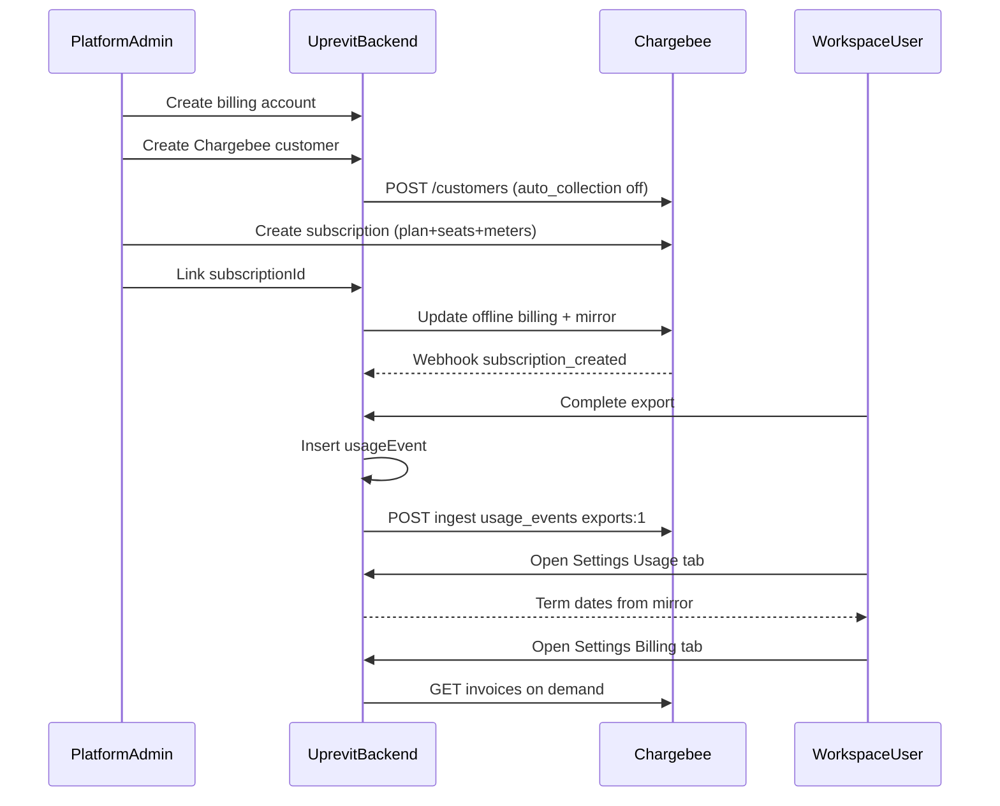

# Chargebee Sandbox + Environment Wiring Handoff

Reference plan: [final_billing_plan_75f87ade.plan.md](/Users/amit/Developer/Startup/uprevit-ui/.cursor/plans/final_billing_plan_75f87ade.plan.md)

Implementation is already done in both repos. This plan covers **external Chargebee setup** and **env/deployment wiring** only.

**Scope decision:** one shared Chargebee **test/sandbox site** for local + `develop` + `demo`. Production gets its own site later.

---

## What the code expects (do not change without code updates)

### Usage Events ingest API

Backend posts to:

```text
POST https://{CHARGEBEE_SITE}.ingest.chargebee.com/api/v2/usage_events
```

Payload property names are **exact** (defined in `[chargebeeUsageEvents.ts](/Users/amit/Developer/Startup/uprevit-backend/src/utils/billing/chargebeeUsageEvents.ts)`):


| Event            | `properties` sent                       |
| ---------------- | --------------------------------------- |
| Export completed | `{ exports: 1 }` (or N for adjustments) |
| Upload committed | `{ upload_mb: ceil(bytes / 1MB) }`      |


- `deduplication_id` max 36 chars (e.g. `export:{jobId}`, upload key hash)
- `usage_timestamp` = event time in **milliseconds**
- 12-hour retry window; after that → `manual_correction_required`

### Webhook mirror

Endpoint (already deployed via SAM): `POST /billing/webhooks/chargebee`

Handler: `[chargebeeWebhook.ts](/Users/amit/Developer/Startup/uprevit-backend/src/controllers/billing/chargebeeWebhook.ts)`

Processes:

- `subscription_created`, `subscription_changed`, `subscription_renewed`, `subscription_activated`, `subscription_reactivated` → mirror plan, term dates, seat qty, SSO add-on
- `invoice_generated`, `invoice_updated` (payment_due/not_paid) → `past_due`
- `payment_succeeded` → clear past due

Seat/SSO detection uses **item price IDs** from env vars matched against `subscription_items[].item_price_id` (`[chargebeeWebhooks.ts](/Users/amit/Developer/Startup/uprevit-backend/src/utils/billing/chargebeeWebhooks.ts)`).

### Customer / subscription linking (platform admin)

1. `POST /platform-admin/workspaces/{id}/chargebee/customer` → creates Chargebee customer id `ws_{workspaceId}`, `auto_collection: off`
2. Create subscription **manually in Chargebee UI** for that customer
3. `POST /platform-admin/workspaces/{id}/chargebee/subscription/link` with `{ subscriptionId }` → sets offline billing (`auto_collection: off`, `invoice_immediately: false`), mirrors profile, retries `pending_link` events

Plan item price IDs are **not** env vars — they are read from the linked subscription via webhook/API mirror.

---

## Part A — Chargebee sandbox catalog setup (agent task)

### A1. Create the sandbox site

1. Log into [Chargebee](https://www.chargebee.com/) → create a **new test site** (not reusing any legacy `exports-USD-Monthly` catalog).
2. Record the **site subdomain** only (e.g. if URL is `https://uprevit-dev-test.chargebee.com`, site = `uprevit-dev-test`).
3. Confirm **Product Catalog 2.0** (PC2) is active (Items / Item Prices model, not legacy Plans-only UI).

### A2. Product family and items

Create one product family, e.g. **Uprevit Platform**.


| Item type                          | Suggested item ID  | Suggested name   | Description                                       |
| ---------------------------------- | ------------------ | ---------------- | ------------------------------------------------- |
| Plan                               | `uprevit-platform` | Uprevit Platform | Base workspace subscription                       |
| Add-on                             | `-seats`           | Additional Seats | Per-seat licensing (non-metered)                  |
| Add-on                             | `sso`              | SSO              | Single sign-on entitlement (non-metered, qty 0/1) |
| Metered charge (or metered add-on) | `exports`          | Exports          | Usage-based export billing                        |
| Metered charge (or metered add-on) | `upload-usage`     | Upload usage     | Usage-based upload billing (MB)                   |


### A3. Usage meters (critical)

In Chargebee **Usage Events / Meters** (or Features & Meters in PC2), create two meters with these **exact property names**:


| Meter property name | Aggregation | Unit label | Used by code                        |
| ------------------- | ----------- | ---------- | ----------------------------------- |
| `exports`           | Sum         | exports    | Export jobs + export adjustments    |
| `upload_mb`         | Sum         | MB         | Upload commits + upload adjustments |


Attach metered pricing to the export/upload items. Sandbox pricing can be nominal (e.g. $0.01/export, $0.001/MB) — commercial rates are a business decision.

### A4. Item prices (monthly minimum; yearly optional)

Create item prices. Suggested IDs (match test conventions in `[chargebeeWebhooks.test.ts](/Users/amit/Developer/Startup/uprevit-backend/src/tests/unit/chargebeeWebhooks.test.ts)`):


| Item price ID                  | Item          | Period  | Pricing model                         | Qty      |
| ------------------------------ | ------------- | ------- | ------------------------------------- | -------- |
| `uprevit-platform-USD-Monthly` | Platform plan | Monthly | Flat fee                              | 1        |
| `uprevit-platform-USD-Yearly`  | Platform plan | Yearly  | Flat fee                              | 1        |
| `additional-seats-USD-Monthly` | Seats add-on  | Monthly | Per unit                              | variable |
| `additional-seats-USD-Yearly`  | Seats add-on  | Yearly  | Per unit                              | variable |
| `sso-USD-Monthly`              | SSO add-on    | Monthly | Flat or per unit                      | 0 or 1   |
| `sso-USD-Yearly`               | SSO add-on    | Yearly  | Flat or per unit                      | 0 or 1   |
| `exports-USD-Monthly`          | Exports meter | Monthly | Metered (linked to `exports` meter)   | —        |
| `upload-usage-USD-Monthly`     | Upload meter  | Monthly | Metered (linked to `upload_mb` meter) | —        |


**Env vars needed from this step:**

- `CHARGEBEE_SEAT_ADDON_ITEM_PRICE_ID` → monthly seat price ID (e.g. `additional-seats-USD-Monthly`)
- `CHARGEBEE_SSO_ADDON_ITEM_PRICE_ID` → monthly SSO price ID (e.g. `sso-USD-Monthly`)

If subscriptions will be yearly, still set env to the **monthly** addon IDs unless you standardize on yearly — webhook matching is by exact `item_price_id`. Document which cadence platform ops will use when creating subscriptions.

### A5. Subscription template for test customers

When creating a test subscription in Chargebee for customer `ws_{workspaceId}`:

- Base plan item (qty 1)
- Seat add-on (qty = purchased seats, e.g. 10)
- SSO add-on (optional, qty 1)
- Metered export item
- Metered upload item
- **Offline-friendly:** `auto_collection = off` (code also enforces this on link)

### A6. API key

1. Chargebee → **Settings → Configure Chargebee → API Keys and Webhooks → API Keys**
2. Create a **Full Access** key for the sandbox site
3. Save as `CHARGEBEE_API_KEY` (never commit)

URL pattern: `https://{site}.chargebee.com/apikeys_and_webhooks/api`

### A7. Webhook

1. Same page → **Webhooks → Add Webhook**
2. **URL:** `https://{API_GATEWAY_ID}.execute-api.us-east-1.amazonaws.com/Prod/billing/webhooks/chargebee`
  - Get `{API_GATEWAY_ID}` from CloudFormation stack output `ApiBaseUrl` for the target backend stack (`develop` / `demo`)
  - For **local SAM**, webhooks require a tunnel (ngrok/Cloudflare) pointing at `http://127.0.0.1:3000/billing/webhooks/chargebee` — optional for initial catalog setup
3. **Authentication:** HTTP Basic Auth
  - Choose a username → `CHARGEBEE_WEBHOOK_USERNAME` (e.g. `uprevit-webhook`)
  - Generate a strong password → `CHARGEBEE_WEBHOOK_PASSWORD`
4. **Events to enable** (minimum):
  - `subscription_created`, `subscription_changed`, `subscription_renewed`, `subscription_activated`, `subscription_reactivated`
  - `invoice_generated`, `invoice_updated`
  - `payment_succeeded`
5. Save and use Chargebee’s “Test webhook” if available

Auth validation in code: `[chargebeeWebhook.ts](/Users/amit/Developer/Startup/uprevit-backend/src/controllers/billing/chargebeeWebhook.ts)` — fails closed if username/password env vars are missing or mismatch.

### A8. Deliverables from Chargebee agent

Produce a short setup record (markdown or table) with:

```text
CHARGEBEE_SITE=<subdomain>
CHARGEBEE_API_KEY=<secret>
CHARGEBEE_WEBHOOK_USERNAME=<username>
CHARGEBEE_WEBHOOK_PASSWORD=<secret>
CHARGEBEE_SEAT_ADDON_ITEM_PRICE_ID=<monthly-seat-item-price-id>
CHARGEBEE_SSO_ADDON_ITEM_PRICE_ID=<monthly-sso-item-price-id>
```

Plus: example subscription ID used for first test, and confirmation that meters use `exports` and `upload_mb`.

---

## Part B — Backend environment variables (6 total)

All defined in `[chargebeeConfig.ts](/Users/amit/Developer/Startup/uprevit-backend/src/config/chargebeeConfig.ts)` and `[env.example.json](/Users/amit/Developer/Startup/uprevit-backend/env.example.json)`.


| Variable                             | Secret? | Purpose                                   |
| ------------------------------------ | ------- | ----------------------------------------- |
| `CHARGEBEE_SITE`                     | No      | Site subdomain only (no `.chargebee.com`) |
| `CHARGEBEE_API_KEY`                  | **Yes** | REST API + Usage Events ingest            |
| `CHARGEBEE_WEBHOOK_USERNAME`         | No      | Webhook Basic Auth user                   |
| `CHARGEBEE_WEBHOOK_PASSWORD`         | **Yes** | Webhook Basic Auth password               |
| `CHARGEBEE_SEAT_ADDON_ITEM_PRICE_ID` | No      | Match seat add-on on subscription         |
| `CHARGEBEE_SSO_ADDON_ITEM_PRICE_ID`  | No      | Detect SSO add-on on subscription         |


### B1. Local development (`env.json`)

Backend does **not** use a simple `.env` file. It uses gitignored `[env.json](/Users/amit/Developer/Startup/uprevit-backend/env.example.json)` → normalized to `.sam-local-env.json` by `[scripts/prepare-sam-env.mjs](/Users/amit/Developer/Startup/uprevit-backend/scripts/prepare-sam-env.mjs)`.

Steps:

1. Copy `env.example.json` → `env.json` (if not already present)
2. Fill all six keys under `Parameters`
3. Also duplicate `CHARGEBEE_SITE` + `CHARGEBEE_API_KEY` under `ProcessProductExportJobFunction` (export worker syncs usage on job completion — see `[template.yaml` L875-887](/Users/amit/Developer/Startup/uprevit-backend/template.yaml))
4. Run `npm run start:local` from repo root (or `npm run start:local` in `src/`)

SAM globals inject all six vars into most Lambdas; export worker explicitly needs site + API key.

### B2. AWS deployed environments (develop + demo) — **requires code change**

`[template.yaml](/Users/amit/Developer/Startup/uprevit-backend/template.yaml)` already declares CloudFormation parameters `ChargebeeSite`, `ChargebeeApiKey`, etc. and injects them into Lambda globals.

**Gap:** `[.github/workflows/deploy.yml](/Users/amit/Developer/Startup/uprevit-backend/.github/workflows/deploy.yml)` does **not** pass Chargebee params to `sam deploy` yet. Must add:

**GitHub environment variables** (per `develop` and `demo` — can share same sandbox values initially):

- `CHARGEBEE_SITE`
- `CHARGEBEE_WEBHOOK_USERNAME`
- `CHARGEBEE_SEAT_ADDON_ITEM_PRICE_ID`
- `CHARGEBEE_SSO_ADDON_ITEM_PRICE_ID`

**GitHub environment secrets:**

- `CHARGEBEE_API_KEY`
- `CHARGEBEE_WEBHOOK_PASSWORD`

**Update `deploy.yml`** `sam deploy --parameter-overrides` block to include:

```bash
"ChargebeeSite=${{ vars.CHARGEBEE_SITE }}" \
"ChargebeeApiKey=${{ secrets.CHARGEBEE_API_KEY }}" \
"ChargebeeWebhookUsername=${{ vars.CHARGEBEE_WEBHOOK_USERNAME }}" \
"ChargebeeWebhookPassword=${{ secrets.CHARGEBEE_WEBHOOK_PASSWORD }}" \
"ChargebeeSeatAddonItemPriceId=${{ vars.CHARGEBEE_SEAT_ADDON_ITEM_PRICE_ID }}" \
"ChargebeeSsoAddonItemPriceId=${{ vars.CHARGEBEE_SSO_ADDON_ITEM_PRICE_ID }}"
```

Also add these names to the “Validate deploy configuration” required-vars check (secrets validated by presence at deploy time).

After merge + deploy, **re-register webhook URL** if API Gateway ID changed.

### B3. Manual one-off SAM deploy (alternative)

```bash
sam deploy \
  --stack-name uprevit-test \
  --parameter-overrides \
    "ChargebeeSite=..." \
    "ChargebeeApiKey=..." \
    "ChargebeeWebhookUsername=..." \
    "ChargebeeWebhookPassword=..." \
    "ChargebeeSeatAddonItemPriceId=..." \
    "ChargebeeSsoAddonItemPriceId=..."
```

---

## Part C — Frontend (no Chargebee env vars)

The product app talks to the backend only. **No `CHARGEBEE_`* variables** in `[apps/app/.env.example](/Users/amit/Developer/Startup/uprevit-ui/apps/app/.env.example)`.

Existing vars remain:

- `API_PROXY_TARGET` → backend API base URL (local)
- Cognito `NEXT_PUBLIC_`* vars

For Amplify (`develop` / `demo` branches): no Chargebee secrets needed. Ensure `API_PROXY_TARGET` (or equivalent backend URL config) points at the stack where Chargebee env is configured.

Customer-facing UI already hides “Chargebee” branding in Billing/Usage tabs; platform-admin UI still says “Chargebee” (operator-only).

---

## Part D — End-to-end verification checklist

After catalog + env wiring:




| Step | Action                                                             | Expected                                                        |
| ---- | ------------------------------------------------------------------ | --------------------------------------------------------------- |
| 1    | Deploy backend with all 6 Chargebee params                         | Lambdas have env vars (check one function in AWS console)       |
| 2    | Platform admin → workspace → create billing account                | Account in `draft`                                              |
| 3    | Create Chargebee customer                                          | Customer `ws_{workspaceId}` in Chargebee                        |
| 4    | In Chargebee, create subscription with plan + seat + metered items | Active subscription                                             |
| 5    | Link subscription in platform admin                                | `chargebee.subscriptionId` set; seats/SSO mirrored              |
| 6    | Run export to completion                                           | `usageEvents` row + `chargebeeSync.status = synced`             |
| 7    | Upload a file                                                      | `usageEvents` row + `upload_mb` synced                          |
| 8    | Workspace Settings → Usage                                         | “Subscription term” badge, correct period                       |
| 9    | Workspace Settings → Billing                                       | Plan name, invoices list                                        |
| 10   | Break API key temporarily                                          | Export still succeeds; sync status `failed`; manual retry works |
| 11   | Webhook test from Chargebee                                        | 200 from `/billing/webhooks/chargebee`                          |


Backend tests to run after env wiring: `npm --prefix src test -- billing chargebee platformAdmin`

---

## Part E — What is NOT in scope for the Chargebee agent

- Code changes (except the `deploy.yml` parameter-overrides PR if assigned)
- Production Chargebee site (separate site + keys when going live)
- Quote/checkout flows (deferred in plan)
- Workspace notification preferences (deferred)
- CSV bulk upload for `manual_correction_required` events (document only)

---

## Summary for handoff

**Chargebee agent:** Create sandbox site → PC2 catalog (plan, seat add-on, SSO add-on, `exports` + `upload_mb` meters) → API key → webhook with Basic Auth → return 6 env values + test subscription.

**Backend agent / you:** Put values in `env.json` locally; add GitHub vars/secrets + update `deploy.yml` for develop/demo; redeploy; point webhook at API Gateway URL.

**Frontend:** Nothing to add for Chargebee — only ensure backend URL is correct.