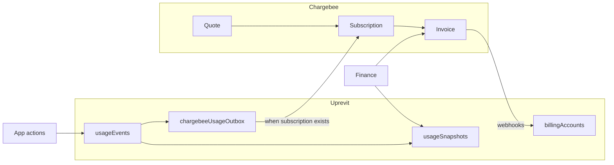
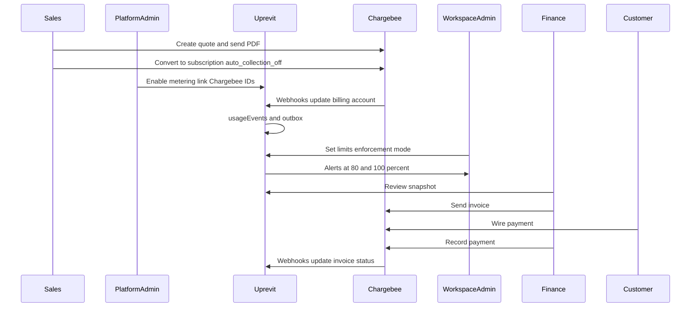

# Usage tracking, billing, and Chargebee (updated)

## What we are building (plain English)

- **One product** on the website: Uprevit. No self-serve checkout. No Growth vs Enterprise tiers.
- **Contract length:** Quarterly or yearly only.
- **Who pays for what:** Each **workspace** is one customer for billing. One billing record in Uprevit, one customer in Chargebee.
- **Usage:** Uprevit counts seats, exports, and storage first. Those numbers sync to Chargebee so invoices can include overage.
- **Contract limits** (e.g. 56 seats, 100 exports): Stored **only in Uprevit**. Used for warnings, emails, and optional blocking. Chargebee does not store custom per-deal caps.
- **Payments:** Customers pay by **bank wire** using instructions on the invoice. Finance marks paid in Chargebee. **Never** turn on auto-charge.
- **Quotes:** Sales creates quotes in **Chargebee only** for v1. Uprevit shows quote/invoice status. In-app quoting comes later (Chargebee counts quotes and limits can bite).
- **Metering is opt-in:** Existing workspaces do **not** start counting usage until your internal team turns it on. Test workspaces can turn on full billing features to validate tracking and Chargebee.

Domain glossary (from grill session): [uprevit-backend/CONTEXT.md](file:///Users/amit/Developer/Startup/uprevit-backend/CONTEXT.md)

---

## Who does what

| Party                                | Role                                                                                                                  |
| ------------------------------------ | --------------------------------------------------------------------------------------------------------------------- |
| **Uprevit (MongoDB)**                | Usage ledger, period summaries, limits, warnings, enforcement, mirror of quotes/invoices                              |
| **Chargebee**                        | Customer, subscription, quote, invoice, wire payment recording, subscription status                                   |
| **Sales / finance**                  | Quote in Chargebee, convert to subscription, **look at Uprevit usage**, send invoice in Chargebee, mark wire received |
| **Workspace admin**                  | See billing tab, edit included limits, choose overage vs block, get alert emails                                      |
| **Platform admin (Cognito `admin`)** | Turn metering on/off per workspace, link Chargebee customer, set pilot/test accounts                                  |

**Finance “review” (v1):** There is no approve button in Uprevit. Finance opens Uprevit to see usage for the subscription term, checks it against what Chargebee will bill, fixes anything in Chargebee if needed, then **sends the invoice from Chargebee**. Uprevit can flag if totals do not match Chargebee (reconciliation).

---

## Payments

**Rule:** Auto-collection is **always off** on customer create and subscription create. Do not store or expose an auto-pay toggle in the app.

**Default path:** Manual wire (`paymentMode: offline_wire` on billing account — metadata only, not a customer-facing switch).

**Later (Phase 0 sandbox, not blocking engineering):** Pay Online link on invoice email, or virtual bank account. Document choice on billing account when you add it.

---

## Chargebee catalog (Phase 0 sandbox)

1. Enable **quarterly** and **yearly** billing frequencies in Chargebee site settings (PC 2.0 custom frequencies).
2. One plan item: **Uprevit** with price points e.g. `uprevit-quarterly-usd`, `uprevit-yearly-usd`.
3. **Metered features** (names aligned in sandbox):
  - `activated_seat_month`
  - `completed_export`
  - `storage_gb`
4. **SSO:** Recurring **add-on** price points (`sso-quarterly`, `sso-yearly`) — **not** a usage meter. When `ssoEnabled` is true in Uprevit, attach add-on via API; remove when false.
5. All recurring lines on a subscription use the **same** billing period (quarterly **or** yearly). Do not mix annual platform + monthly overage on one subscription unless you explicitly enable multi-frequency billing in Chargebee.
6. Quotes + invoice emails in sandbox; test usage event ingestion (advanced / event-based if available).
7. Confirm customer + subscription creation always sets `auto_collection: off`.

**Chargebee docs:** [Usage billing](https://www.chargebee.com/docs/billing/2.0/usage-based-billing/understanding-usages), [Ingesting usage](https://www.chargebee.com/docs/billing/2.0/usage-based-billing/ingesting-usage-events-into-chargebee), [Quotes](https://www.chargebee.com/docs/billing/2.0/invoices-credit-notes-and-quotes/quotes)

---

## MongoDB collections

### `billingAccounts` (one per workspace)

| Field                                                        | Purpose                                                                             |
| ------------------------------------------------------------ | ----------------------------------------------------------------------------------- |
| `workspaceId`                                                | Unique link to workspace                                                            |
| `meteringEnabled`                                            | **Default `false`.** When true, record usage and run sync. Platform admin toggles.  |
| `status`                                                     | `draft` | `pilot` | `active` | `churned` (pilot = internal/test with full features) |
| `chargebeeCustomerId`, `chargebeeSubscriptionId`             | Chargebee linkage                                                                   |
| `billingCadence`                                             | `quarterly` | `yearly`                                                              |
| `currency`, `netTermDays`                                    | Commercial terms                                                                    |
| `paymentMode`                                                | Default `offline_wire`; optional later: `pay_now`, `virtual_bank`                   |
| `ssoEnabled`                                                 | Contract SSO flag (sales/platform sets; not inferred from Cognito)                  |
| `includedSeatMonths`, `includedExports`, `includedStorageGb` | Limits for UI, alerts, enforcement — **workspace admins can edit**                  |
| `enforcementMode`                                            | `overage` (default) | `block` — workspace admin sets in Settings                    |
| `periodStart`, `periodEnd`                                   | Copy of Chargebee subscription current term for snapshots/UI                        |
| `createdAt`, `updatedAt`                                     |                                                                                     |

**Indexes:** unique on `workspaceId`.

**Legacy:** Keep `workspaces.plan*` for migration/display only; do not use for billing logic.

**Do not create** billing accounts for every workspace automatically at launch. Create when platform admin sets up billing or enables metering. Internal test workspaces: `status: pilot`, `meteringEnabled: true`, full limits + enforcement + sandbox Chargebee IDs.

### `usageEvents` (immutable ledger)

Only written when `billingAccounts.meteringEnabled === true`.

| Field                                                  | Purpose                                             |
| ------------------------------------------------------ | --------------------------------------------------- |
| `workspaceId`, `metric`, `quantity`, `unit`            |                                                     |
| `occurredAt`, `billingPeriodStart`, `billingPeriodEnd` | Period = subscription term dates on billing account |
| `source`, `sourceId`                                   | Traceability                                        |
| `idempotencyKey`                                       | Unique dedupe                                       |
| `chargebeeSyncStatus`                                  | `pending` | `synced` | `failed`                     |
| `chargebeeEventId`                                     | After sync                                          |
| `metadata`                                             |                                                     |

**Metrics (v1):**

- `activated_seat_month`
- `completed_export`
- `storage_bytes_snapshot` (daily point-in-time total)

**Removed from original plan:** `sso_enabled` usage events — SSO uses add-on attach/detach instead.

**Future:** `users.billable: false` for support staff in customer workspaces (excluded from seat-month).

### `chargebeeUsageOutbox`

Same as before; process only if `meteringEnabled` and `chargebeeSubscriptionId` present.

### `usageSnapshots`

One row per workspace per **subscription term** (`periodStart`–`periodEnd` from billing account / Chargebee webhook).

Aggregates: seat-months (sum calendar-month events in term), exports, storage bytes/GB, `ssoEnabled` boolean for finance view.

`reconciliationStatus`: `ok`  `mismatch`  `pending`.

### `billingDocuments`, `chargebeeWebhookEvents`

Unchanged intent: mirror quotes/invoices; idempotent webhooks.

---

## Usage rules

### Seats (`activated_seat_month`)

- Count when user becomes `**active`** ([onboardAndUpdateInvitedUser.ts](file:///Users/amit/Developer/Startup/uprevit-backend/src/controllers/onboarding/onboardAndUpdateInvitedUser.ts)) — not on invite alone.
- **Everyone active counts**, including workspace admins.
- **One seat-month per user per calendar month** when they first go active that month.
- **No take-back** if deactivated mid-month.
- **Idempotency:** `{workspaceId}:{userId}:activated_seat_month:{YYYY-MM}`
- Skip users with `billable: false` when that field exists (support users — later).

### Exports (`completed_export`)

- Emit only after successful [markExportJobCompleted](file:///Users/amit/Developer/Startup/uprevit-backend/src/utils/exportJobs.ts) in [processExportJob.ts](file:///Users/amit/Developer/Startup/uprevit-backend/src/controllers/exports/processExportJob.ts).
- **One completed job = one export** (product and report exports).
- **Idempotency:** `exportJobId`.

### Storage (`storage_bytes_snapshot`)

- **Billable storage** = sum of bytes for:
  - [sourceFiles](file:///Users/amit/Developer/Startup/uprevit-backend/src/models/sourceFiles.ts) — add `sizeBytes`, `contentType`
  - Product assets (`uploads/{workspaceId}/product/...`)
  - Workspace assets (`uploads/{workspaceId}/workspace/...`)
- Add `sizeBytes` on create; pass `file.size` from [useUploadFilesToS3.ts](file:///Users/amit/Developer/Startup/uprevit-ui/apps/app/hooks/s3-storage/useUploadFilesToS3.ts) at all upload call sites.
- **Daily snapshot** per workspace when metering on (GB for display; bytes in DB).
- One-time S3/metadata backfill for existing files on pilot workspaces.

### SSO

- `billingAccounts.ssoEnabled` set by platform admin / sales.
- Sync: attach or remove Chargebee SSO **add-on** on subscription (same cadence as plan).
- Show SSO on/off in billing tab; no usage outbox for SSO.

---

## Alerts and past-due

### Usage alerts

- **Who:** All workspace admins (Cognito workspace admin group).
- **When:** **80%** and **100%** of each included limit (seats, exports, storage).
- **How:** In-app warning always; email when outbound email is wired (if no mail service yet, ship in-app first).
- **Enforcement:** Both `overage` and `block` modes show warnings; only `block` stops new invites, exports, uploads.

### Past-due invoice

- From Chargebee webhooks → show **banner** to workspace admins in app.
- **Do not** lock the workspace in v1.

### Limit changes

- Workspace admins edit included limits in Settings.
- **Audit log** every change (who, when, field, old → new) using existing audit pattern.

---

## Chargebee sync

1. App action → if `meteringEnabled` → `usageEvents` → `chargebeeUsageOutbox`.
2. Worker with backoff; update event sync status.
3. **Event sync (near real-time):** seat-months, exports.
4. **Daily job:** storage snapshot, snapshot recompute, reconciliation vs Chargebee meters.
5. **Webhooks:** Update billing account (status, period dates, past-due), `billingDocuments`, subscription IDs.

**Reconciliation:** Compare Uprevit snapshot totals to Chargebee usage for the term; set `mismatch` so finance sees it before sending invoice.

---

## APIs ([uprevit-backend](file:///Users/amit/Developer/Startup/uprevit-backend))

| Method | Path                          | Who             | Purpose                                                                                |
| ------ | ----------------------------- | --------------- | -------------------------------------------------------------------------------------- |
| GET    | `/billing/summary`            | Workspace admin | Account, usage, limits, period snapshot, documents, sync/reconciliation, past-due flag |
| PUT    | `/billing/enforcement-mode`   | Workspace admin | `overage` | `block`                                                                    |
| PUT    | `/billing/included-limits`    | Workspace admin | Update caps + audit                                                                    |
| POST   | `/billing/metering`           | Platform admin  | Enable/disable metering, set status pilot/active                                       |
| POST   | `/billing/chargebee/customer` | Platform admin  | Create/link customer, `auto_collection: off`                                           |
| POST   | `/billing/chargebee/sso`      | Platform admin  | Toggle SSO add-on from `ssoEnabled`                                                    |
| POST   | `/billing/usage/reconcile`    | Platform admin  | Recompute + compare Chargebee                                                          |
| POST   | `/billing/usage/sync`         | Platform admin  | Retry outbox                                                                           |
| POST   | `/billing/webhooks/chargebee` | Chargebee       | Signed, idempotent                                                                     |

**Enforcement checks** (when `meteringEnabled` and over limit): invite ([createUser](file:///Users/amit/Developer/Startup/uprevit-backend/src/controllers/users/createUser.ts)), export enqueue, presign upload — respect `enforcementMode`.

**Env:** `CHARGEBEE_SITE`, `CHARGEBEE_API_KEY`, `CHARGEBEE_WEBHOOK_SECRET`, item/meter/add-on IDs.

**SAM:** Webhook Lambda, outbox worker, daily reconciliation in [template.yaml](file:///Users/amit/Developer/Startup/uprevit-backend/template.yaml).

---

## Frontend ([uprevit-ui](file:///Users/amit/Developer/Startup/uprevit-ui))

### Marketing

- [pricing/page.tsx](file:///Users/amit/Developer/Startup/uprevit-ui/apps/marketing/app/pricing/page.tsx): Single Uprevit plan; quarterly/yearly by quote after demo.
- [PricingCalculatorCards.tsx](file:///Users/amit/Developer/Startup/uprevit-ui/apps/marketing/features/pricing/PricingCalculatorCards.tsx): **Estimate only**, not checkout.

### App billing tab

- Enable tab in [settings/page.tsx](file:///Users/amit/Developer/Startup/uprevit-ui/apps/app/app/(app)/settings/page.tsx).
- Replace placeholder [BillingTab.tsx](file:///Users/amit/Developer/Startup/uprevit-ui/apps/app/features/workspace/settings/BillingTab.tsx) with API data.
- Show: cadence, status, limits, usage vs limits, enforcement toggle, SSO flag (read-only for workspace admin unless you allow edit on limits only), latest quote/invoice links, sync/reconciliation, past-due banner.
- No checkout CTA — contact billing / request quote update copy.

### Hooks

- `useGetBillingSummary`
- `useUpdateBillingEnforcementMode`
- `useUpdateBillingIncludedLimits`

---

## End-to-end flow

---

## Phased delivery

### Phase 0 — Chargebee sandbox (no app code)

- Catalog: plan, quarterly/yearly, meters, SSO add-ons.
- Quotes, invoices, auto-collection off, wire flow, test usage ingestion.

### Phase 1 — Usage foundation

- Collections + indexes.
- `billingAccounts` with `meteringEnabled` default false.
- Instrument seats, exports, storage (`sizeBytes` + uploads).
- Snapshots job (no Chargebee yet).
- Platform admin API to enable metering on test workspaces.

### Phase 2 — Chargebee sync

- Outbox worker, webhooks, reconciliation, `billingDocuments`.
- SSO add-on attach/detach.
- Period dates from subscription webhooks.

### Phase 3 — APIs + UI

- Billing tab, marketing pricing, enforcement on invite/export/upload.
- Alerts (in-app; email if ready).
- Included limits editor + audit.

### Phase 4 — Later

- In-app quote creation (watch Chargebee quote limits).
- Pay Online / virtual bank.
- Support user `billable: false`.
- Optional lockout on past-due.
- Past-due automation beyond banner.

---

## Test plan (unchanged intent, updated rules)

**Backend unit**

- No usage events when `meteringEnabled` false.
- Seat on activation only; idempotency; no reversal on deactivate.
- Export only after `markExportJobCompleted`.
- Storage sums all three scopes; delete lowers total.
- SSO does not create usage events; add-on API called on toggle.
- Webhook/outbox idempotency; tenant isolation.

**Integration**

- Snapshot matches events for subscription term.
- Reconciliation flags mismatch.
- Limit change writes audit log.

**Frontend**

- Single marketing plan; calculator labeled estimate.
- Billing tab states: no account, metering off, active, past-due banner, mismatch flag.
- Enforcement toggle; limit edit; non-admins blocked.

---

## Assumptions (updated)

- Workspace = billable tenant; no multi-workspace invoice in v1.
- Metering opt-in by platform admin; test workspaces use full billing features.
- Billing period = Chargebee subscription term; seat-months tagged by calendar month inside that term.
- Included limits live in Uprevit only; Chargebee uses catalog defaults for overage math.
- Workspace admins edit limits; changes audited.
- Default enforcement: allow overage with warnings.
- Default payment: manual wire; no auto-collection ever.
- Quotes in Chargebee only for v1.
- Finance reviews usage in Uprevit informally; invoice sent from Chargebee.
- Storage v1 = daily GB snapshot, not byte-hours.
- Support users excluded from seats when implemented.

