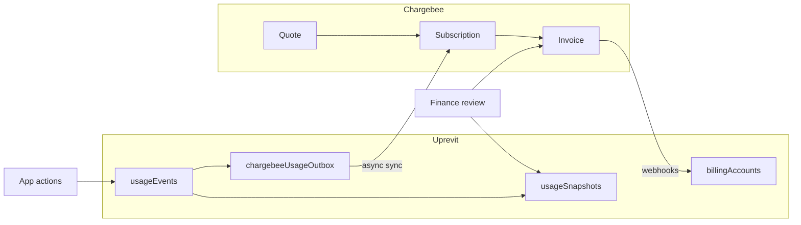
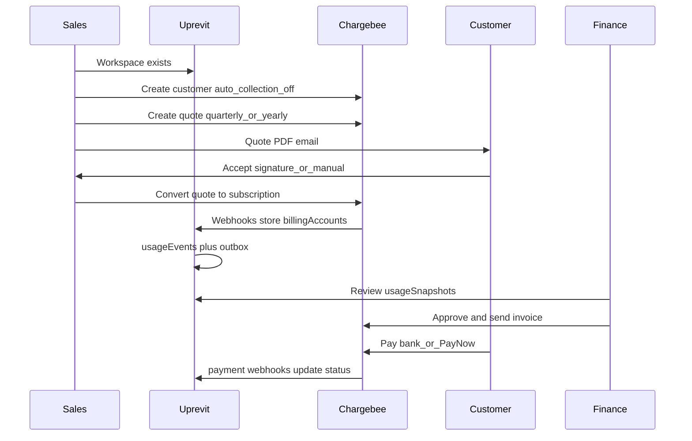

# Usage tracking, billing, and Chargebee integration

## Goals

- **One product:** Uprevit — no self-serve checkout, no Growth/Enterprise split on marketing.
- **Cadence:** Quarterly and yearly contracts only (configure exact Chargebee catalog after you review their docs).
- **Payments:** No auto-pay. Every Chargebee customer/subscription is created with **auto-collection disabled**. There is **no in-app or admin toggle** for auto-collection. Customers pay when finance sends an invoice (bank transfer preferred; exact gateway path chosen in Phase 0).
- **Usage:** Uprevit records all usage first; Chargebee receives synced usage for invoicing. Finance **reviews usage before** approving/sending period invoices.
- **Dimensions:** Activated seat-months, completed exports, storage (GB), SSO enabled.

**Chargebee references:** [Usage thresholds](https://www.chargebee.com/docs/billing/2.0/usage-based-billing/understanding-usages), [Usage event ingestion](https://www.chargebee.com/docs/billing/2.0/usage-based-billing/ingesting-usage-events-into-chargebee), [Quotes](https://www.chargebee.com/docs/billing/2.0/invoices-credit-notes-and-quotes/quotes), [ACH via Stripe](https://www.chargebee.com/docs/payments/2.0/payment-gateways-and-configuration/ach-payments-stripe).

---

## System boundaries

| System                | Responsibility                                                                           |
| --------------------- | ---------------------------------------------------------------------------------------- |
| **Uprevit (MongoDB)** | Immutable usage ledger, period snapshots, finance review UI, reconciliation vs Chargebee |
| **Chargebee**         | Customer, quote, subscription, invoice, payment recording, subscription status           |
| **Finance / sales**   | Quote negotiation, quote acceptance, invoice approval, payment follow-up                 |

---

## Payments (no auto-collection)

**Policy:** Auto-collection is **never** enabled. Do not store `autoCollection` on `billingAccounts` or expose it in the UI. When creating Chargebee customers/subscriptions via API, always set `auto_collection: off` (or equivalent in Product Catalog 2.0).

**How customers pay (choose in Phase 0 sandbox — not blocked on engineering):**

| Option                        | What it is                                                                                     | When to use                                                             |
| ----------------------------- | ---------------------------------------------------------------------------------------------- | ----------------------------------------------------------------------- |
| **A — Pay Now**               | Link on invoice email → Chargebee hosted page; card or ACH direct debit if gateway supports it | Customers who want to pay online without saving a card for auto-renewal |
| **C — Virtual bank account**  | Per-customer bank details on invoice; Stripe/Chargebee reconciles incoming wire/ACH credit     | US B2B; less manual “record payment” work                               |
| **D — Offline bank transfer** | Static wire instructions on PDF; finance uses **Record payment** in Chargebee                  | Fallback or non-US / no gateway reconciliation                          |

`billingAccounts.paymentMode` (optional metadata only): `pending_evaluation | pay_now | virtual_bank | offline_wire` — documents which path was configured for that customer; **not** a user-facing switch.

Enable Pay Now on invoice emails only if the selected gateway supports the methods you want.

---

## Chargebee catalog and billing alignment

### Product catalog (v1 target)

1. Enable **3-month (quarterly)** and **yearly** billing frequencies in Chargebee Product Catalog settings.
2. One product family, one plan item: `**Uprevit`**.
3. Two plan price points (names illustrative):
  - `uprevit-quarterly-usd` — `period: 3`, `period_unit: month`
  - `uprevit-yearly-usd` — `period: 1`, `period_unit: year`
4. Metered features / item prices (align names with Chargebee after catalog review):
  - `activated_seat_month`
  - `completed_export`
  - `storage_gb`
  - `sso_enabled` (boolean/flag-style usage or recurring addon — confirm in catalog setup)

**Alignment rule (avoids prior plan confusion):** For each customer subscription, **every recurring line item uses the same billing period** as the contract (quarterly **or** yearly). Platform plan, negotiated flat fees, and metered overage items all share that period. Do **not** mix annual platform + monthly overage on one subscription until Chargebee multi-frequency billing is explicitly enabled for your site.

**Seat-month vs contract cadence:** Contract renews quarterly/yearly; **seat-month events still fire per calendar month** while the user is active (see Usage tracking). Chargebee meters aggregate seat-months across the invoice period.

### Usage-based billing mode

- Prefer **Advanced / event-based usage billing** if available on your site ([ingesting usage events](https://www.chargebee.com/docs/billing/2.0/usage-based-billing/ingesting-usage-events-into-chargebee)).
- Chargebee documents high throughput (e.g. up to ~100M events/month); still implement `**chargebeeUsageOutbox`** so Chargebee downtime never loses usage.

### Quotes and acceptance (no self-serve checkout)

- Use **Chargebee Quotes** (evaluate **CPQ** if you need heavier deal desk; legacy Quotes are being sunset).
- Default flow: **email quote PDF** → customer signature or manual acceptance after email/phone → finance converts to subscription/invoice in Chargebee.
- **Do not** embed Hosted Checkout on the marketing site.
- Hosted quote-accept links: enable only if they do **not** create an unwanted self-serve signup path.
- If native quote signature is insufficient, evaluate **GetAccept / PandaDoc** before building custom e-sign.

### Zero-dollar quotes

Supported for pilots/POCs via $0 price points or coupons on quotes; finance still follows the same acceptance → subscription → invoice flow.

---

## MongoDB collections ([uprevit-backend](file:///Users/amit/Developer/Startup/uprevit-backend))

### `billingAccounts` (one per workspace)

Billing source of truth. Legacy `workspaces.plan`* fields remain for migration/display only.

| Field                                                        | Purpose                                                                          |
| ------------------------------------------------------------ | -------------------------------------------------------------------------------- |
| `workspaceId`                                                | FK to workspace                                                                  |
| `chargebeeCustomerId`, `chargebeeSubscriptionId`             | Chargebee linkage                                                                |
| `billingCadence`                                             | `quarterly` | `yearly`                                                           |
| `status`                                                     | `draft` | `active` | `past_due` | `suspended` | `churned` (synced from webhooks) |
| `currency`, `netTermDays`                                    | Commercial terms                                                                 |
| `paymentMode`                                                | Which payment path was configured (see Payments) — not auto-collection           |
| `ssoEnabled`                                                 | Contract SSO flag (not inferred from Cognito)                                    |
| `includedSeatMonths`, `includedExports`, `includedStorageGb` | Negotiated entitlements for UI/alerts (optional v1)                              |
| `enforcementMode`                                            | `soft_overage` | `hard_limit` (workspace admin choice from earlier decision)     |
| `createdAt`, `updatedAt`                                     |                                                                                  |

Unique index: `workspaceId`.

### `usageEvents` (immutable ledger)

| Field                                                  | Purpose                                |
| ------------------------------------------------------ | -------------------------------------- |
| `workspaceId`, `metric`, `quantity`, `unit`            |                                        |
| `occurredAt`, `billingPeriodStart`, `billingPeriodEnd` |                                        |
| `source`, `sourceId`                                   | e.g. `user`, `exportJob`, `sourceFile` |
| `idempotencyKey`                                       | Unique — dedupe                        |
| `chargebeeSyncStatus`                                  | `pending` | `synced` | `failed`        |
| `chargebeeEventId`                                     | After successful sync                  |
| `metadata`                                             |                                        |

**Metrics:** `activated_seat_month`, `completed_export`, `storage_bytes_delta`, `storage_bytes_snapshot`, `sso_enabled`.

Unique index: `idempotencyKey`.

### `chargebeeUsageOutbox`

Reliable async sync to Chargebee.

| Field                                            | Purpose                                        |
| ------------------------------------------------ | ---------------------------------------------- |
| `usageEventId`, `workspaceId`                    |                                                |
| `chargebeeCustomerId`, `chargebeeSubscriptionId` |                                                |
| `payload`                                        | Serialized Chargebee usage/event API body      |
| `status`                                         | `pending` | `processing` | `synced` | `failed` |
| `attempts`, `lastAttemptAt`, `syncedAt`, `error` |                                                |

### `usageSnapshots` (period summaries)

One row per workspace per billing period (quarterly or yearly window).

| Field                                                                  | Purpose           |
| ---------------------------------------------------------------------- | ----------------- |
| `workspaceId`, `periodStart`, `periodEnd`                              |                   |
| `activatedSeatMonths`, `completedExports`, `storageBytes`, `storageGb` |                   |
| `ssoEnabled`                                                           |                   |
| `chargebeeSyncStatus`, `reconciliationStatus`                          | `ok` | `mismatch` |
| `lastCalculatedAt`                                                     |                   |

### `billingDocuments`

Local mirror of Chargebee quotes/invoices for the app billing tab.

| Field                                        | Purpose             |
| -------------------------------------------- | ------------------- |
| `workspaceId`, `chargebeeDocumentId`, `type` | `quote` | `invoice` |
| `status`, `amount`, `currency`               |                     |
| `hostedUrl`, `pdfUrl`, `dueDate`             |                     |

### `chargebeeWebhookEvents`

Idempotency: `eventId` unique; store `eventType`, `receivedAt`, `processedAt`, `status`, `error`.

---

## Usage tracking rules

### Seats — `activated_seat_month`

- Bill **one seat-month per user per calendar month** when they first become **active** (invited user completes onboarding → `status: active` in `[onboardAndUpdateInvitedUser.ts](file:///Users/amit/Developer/Startup/uprevit-backend/src/controllers/onboarding/onboardAndUpdateInvitedUser.ts)`).
- **No reversal** if the user is deactivated mid-month; that month still counts.
- Each subsequent month the user remains active → one more event.
- **Idempotency key:** `{workspaceId}:{userId}:activated_seat_month:{YYYY-MM}`.
- Hook: user activation path (onboard), not invite-only.

### Exports — `completed_export`

- Source of truth: `[exportJobs](file:///Users/amit/Developer/Startup/uprevit-backend/src/models/exportJob.ts)`.
- Emit **only** when `[markExportJobCompleted](file:///Users/amit/Developer/Startup/uprevit-backend/src/utils/exportJobs.ts)` succeeds in `[processExportJob.ts](file:///Users/amit/Developer/Startup/uprevit-backend/src/controllers/exports/processExportJob.ts)`.
- Count completed product and report exports; ignore `queued` / `processing` / `failed`.
- **Idempotency key:** `exportJobId`.

### Storage

- Add `sizeBytes`, `contentType` to `[sourceFiles](file:///Users/amit/Developer/Startup/uprevit-backend/src/models/sourceFiles.ts)`.
- `[useUploadFilesToS3](file:///Users/amit/Developer/Startup/uprevit-ui/apps/app/hooks/s3-storage/useUploadFilesToS3.ts)` already returns `size: file.size` — pass it into `POST /source-files` when creating records (update all upload call sites).
- Bill on **current total bytes** per workspace (sum of persisted file metadata + workspace/product assets if in scope).
- Emit **daily** `storage_bytes_snapshot` per active `billingAccount`; v1 uses point-in-time GB, not byte-hours (unless finance later requires GB-month).
- One-time **S3 backfill** for existing tenants without `sizeBytes`.

### SSO — `sso_enabled`

- Stored on `billingAccounts.ssoEnabled`; set by admin/sales when contract includes SSO.
- Emit usage/snapshot when toggled; **do not** infer from Cognito groups.

---

## Chargebee usage sync

1. **Write path:** App action → insert `usageEvents` → enqueue `chargebeeUsageOutbox`.
2. **Worker:** Process outbox with exponential backoff; update `chargebeeSyncStatus` on event.
3. **Sync modes:**
  - **Event-level:** `activated_seat_month`, `completed_export` (as soon as outbox processes).
  - **Daily:** `storage_bytes_snapshot`, `sso_enabled` (scheduled job).
4. **Daily reconciliation job:**
  - Recompute `usageSnapshots` from `usageEvents` + live DB totals.
  - Compare totals to Chargebee metered usage for the period.
  - Set `reconciliationStatus: mismatch` for finance before invoice send.

Finance workflow at period close: review Uprevit snapshot + Chargebee → approve/close invoice in Chargebee → send invoice email.

---

## Backend APIs

All tenant routes use existing auth (`requireTenantContext`) and **workspace admin** (`isWorkspaceAdmin`). Webhook is unauthenticated except Chargebee signature verification.

| Method | Path                          | Who                                  | Purpose                                                                                          |
| ------ | ----------------------------- | ------------------------------------ | ------------------------------------------------------------------------------------------------ |
| `GET`  | `/billing/summary`            | Workspace admin                      | Account, current snapshot, period usage, latest quote/invoice mirror, sync/reconciliation status |
| `POST` | `/billing/chargebee/customer` | Platform admin (v1: Chargebee UI ok) | Create/link Chargebee customer; always `auto_collection: off`                                    |
| `POST` | `/billing/chargebee/quote`    | Platform admin                       | Create quote for cadence + negotiated terms                                                      |
| `POST` | `/billing/usage/reconcile`    | Platform admin / internal            | Recompute snapshot + compare to Chargebee                                                        |
| `POST` | `/billing/usage/sync`         | Platform admin / internal            | Retry outbox / force sync                                                                        |
| `PUT`  | `/billing/enforcement-mode`   | Workspace admin                      | `soft_overage` | `hard_limit`                                                                    |
| `POST` | `/billing/webhooks/chargebee` | Chargebee                            | Verify signature; idempotent handler; update `billingAccounts`, `billingDocuments`               |

**Env vars:** `CHARGEBEE_SITE`, `CHARGEBEE_API_KEY`, `CHARGEBEE_WEBHOOK_SECRET`, plus item price / meter IDs for quarterly, yearly, and each metric.

**SAM:** New Lambdas in `[template.yaml](file:///Users/amit/Developer/Startup/uprevit-backend/template.yaml)` for webhook, scheduled reconciliation, and outbox processor.

**Enforcement (phase 3):** On invite, export enqueue, presign upload — check `billingAccounts.enforcementMode` against snapshot + entitlements; soft = warn + allow; hard = 402/403.

---

## End-to-end flow

---

## Frontend ([uprevit-ui](file:///Users/amit/Developer/Startup/uprevit-ui))

### Marketing pricing

- `[apps/marketing/app/pricing/page.tsx](apps/marketing/app/pricing/page.tsx)`: Remove Growth vs Enterprise split; **one Uprevit plan** — quarterly or yearly contracts, custom quote after demo.
- `[PricingCalculatorCards.tsx](apps/marketing/features/pricing/PricingCalculatorCards.tsx)`: Keep as **estimate / sizing guide only** (not checkout, not final price).
- FAQs: final pricing confirmed after demo and Chargebee quote.

### App billing tab

- Uncomment billing tab in `[settings/page.tsx](apps/app/app/(app)`/settings/page.tsx).
- Replace hardcoded data in `[BillingTab.tsx](apps/app/features/workspace/settings/BillingTab.tsx)` with `GET /billing/summary`.
- Show: cadence, status, payment terms, activated seat-months, exports this period, storage used, SSO, latest quote/invoice, sync/reconciliation flags.
- **No checkout CTA** — “Contact billing” / “Request quote update” for admins only.

### Hooks

- `useGetBillingSummary` → `GET /billing/summary`
- `useUpdateBillingEnforcementMode` → `PUT /billing/enforcement-mode` (phase 3)

---

## Current codebase gaps

| Area                    | Today                                     | Needed                                      |
| ----------------------- | ----------------------------------------- | ------------------------------------------- |
| Chargebee               | None                                      | Full integration                            |
| Billing collections     | None                                      | Five collections above                      |
| `sourceFiles.sizeBytes` | Missing                                   | Add + pass `file.size` from uploads         |
| Seats                   | Countable via `users`                     | `activated_seat_month` events on activation |
| Exports                 | `exportJobs`                              | Hook at `markExportJobCompleted`            |
| Marketing               | Growth + Enterprise + calculator as tiers | Single plan + estimate calculator           |
| Billing UI              | Placeholder, tab hidden                   | Live summary from API                       |

---

## Phased delivery

### Phase 0 — Chargebee sandbox (no app code)

- Catalog: Uprevit plan, quarterly/yearly price points, metered features.
- Quotes + invoice emails; **auto-collection off** on all test customers.
- **Payment path spike:** test A (Pay Now), C (virtual bank), D (offline wire); pick default + fallback.
- Advanced usage billing + test event ingestion.

### Phase 1 — Usage foundation (backend)

- Collections + indexes.
- Instrument seats, exports, storage (`sizeBytes` + API payload).
- `usageEvents` + `usageSnapshots` job (no Chargebee yet).

### Phase 2 — Chargebee sync

- `chargebeeUsageOutbox` worker.
- Webhook Lambda + `billingAccounts` + `billingDocuments`.
- Daily reconciliation.

### Phase 3 — APIs + app UI

- `/billing/summary` and admin endpoints.
- Billing tab + marketing pricing refresh.
- Enforcement mode + limits on invite/export/upload.

### Phase 4 — Sales ops (optional)

- Internal admin UI for customer/quote creation (or stay in Chargebee UI).
- Past-due / suspension automation from webhooks.

---

## Test plan

**Backend unit**

- Seat event only when user becomes active; no duplicate same month (idempotency).
- Deactivation does not remove current month’s seat-month.
- Export event only after `markExportJobCompleted`.
- Storage totals from `sizeBytes`; delete reduces total.
- Webhook and outbox idempotency.
- Billing routes reject non-admins and cross-workspace access.

**Backend integration-style**

- Snapshot sums match events for a period.
- Outbox retry leaves no lost events.
- Reconciliation flags mismatch when Chargebee totals differ.

**Frontend manual QA**

- Pricing: one plan, no Growth/Enterprise; calculator labeled estimate.
- Billing tab: loading, no billing account, active, pending invoice, paid, sync mismatch.
- Non-admins cannot change enforcement or see admin actions.

---

## Assumptions

- Quarterly and yearly are the only **contract** cadences; seat-months are metered per calendar month.
- Uprevit is the auditable usage source of truth; Chargebee receives synced usage for invoicing.
- Finance reviews usage before invoices are finalized/sent.
- Auto-collection is never used; no product feature references it.
- Payment gateway choice (Pay Now vs virtual bank vs offline wire) is decided in Phase 0.
- Storage v1 = current total GB snapshot, not byte-hours.
- SSO billing follows `billingAccounts.ssoEnabled`, not Cognito configuration.

