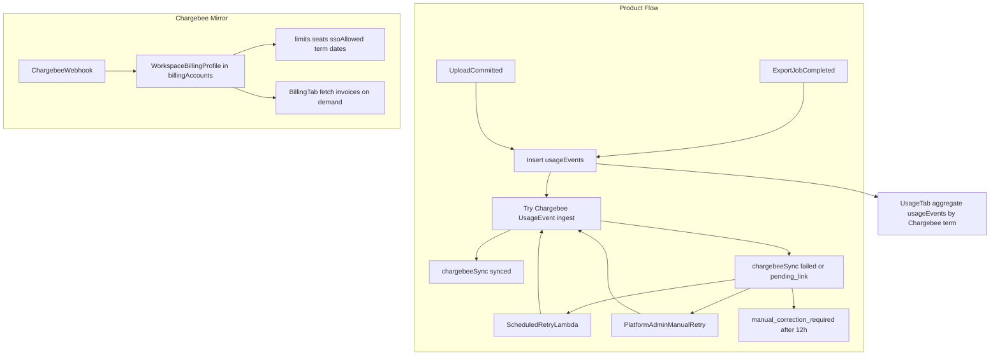

# Final Simplified Billing Plan

## Decisions Locked (from clarification)


| Topic                    | Decision                                                                                                                 |
| ------------------------ | ------------------------------------------------------------------------------------------------------------------------ |
| Chargebee usage API      | **Usage Events ingest API** (not legacy `POST /subscriptions/{id}/usages`)                                               |
| Seats / SSO billing      | **Chargebee is source of truth** — Uprevit mirrors via webhooks; never pushes seat counts to Chargebee                   |
| Usage period (Usage tab) | **Chargebee subscription term** (`current_term_start` / `current_term_end`) once linked                                  |
| Unlinked workspaces      | Record `usageEvents`; `chargebeeSync.status = pending_link` until subscription linked                                    |
| Limits                   | **Hybrid** — seats + SSO from Chargebee mirror; exports + upload limits editable by workspace admin (same `limits` fields; platform admin can also set/override) |
| Invoices (Billing tab)   | **Fetch on demand** from Chargebee API when tab loads (short cache); no `billingDocuments` collection                    |
| Usage adjustments        | **Keep** — platform admin adjustments write `usageEvents` (`platform_adjustment`) and use same Chargebee send/retry path |
| Upload Chargebee unit    | **Integer MB, ceil per commit** — `properties: { upload_mb: N }`                                                         |
| Export Chargebee unit    | **1 event per completed export** — `properties: { exports: 1 }`                                                          |
| Retries                  | **Scheduled Lambda (10–15 min) + manual platform-admin retry** within 12-hour `usage_timestamp` window                   |
| Enforcement mode         | **Workspace admin** — block vs overage on Usage tab; platform admin may override operationally                             |
| Billing notifications    | **Deferred** — no workspace email/push for limit warnings in v1                                                          |
| Quotes                   | **Deferred** — link existing customer/subscription only in v1                                                            |
| SSO feature flag         | **Webhook-driven** — SSO add-on on subscription enables `limits.ssoAllowed` + workspace SSO config                       |
| Freezes                  | **Keep** usage freeze and access freeze                                                                                  |
| Offline/pilot billing    | **auto_collection off** / offline-friendly settings when linking subscriptions                                           |
| Implementation start     | **Hard reset both repos to HEAD** — discard uncommitted Phase 3 work                                                     |
| Chargebee environment    | **New sandbox site** with clean plans, meters, add-ons; update env/AWS after catalog setup                               |


## Architecture




## Phase 1: Platform Operator Control Plane

**No changes.** Keep content from [Updated 3 Phased Plan.md](/Users/amit/Downloads/Updated%203%20Phased%20Plan.md):

- Platform-operator triple gate (`platform-admin` Cognito + registry + active user)
- Platform APIs via `requirePlatformOperator`
- Audit rules unchanged
- No billing complexity added to Phase 1

## Phase 2: Internal Usage And Limits (Revised)

### Purpose

Internal source of truth for **usage capture**, **limit enforcement**, and **usage display**. No Chargebee API calls in Phase 2 code paths except what Phase 3 adds at event-write time.

### Collections (only two)

1. `**usageEvents` — ledger for exports, uploads, platform adjustments
2. `**billingAccounts`** — physical collection; domain name `**WorkspaceBillingProfile\*\`*

Remove from plan and implementation:

- `usageSnapshots` / snapshot approval / recompute
- `billingProviderSyncOutbox` / provider sync
- `billingProviderEvents` (as UI/ops surface)
- `billingDocuments` collection
- reconciliation runs and `reconciliation_backfill` source (unless needed for one-time migration)
- `billingAddOnEvents` (SSO history replaced by webhook mirror + profile state)

Optional: drop `usageAdjustments` collection — adjustments write directly to `usageEvents` with audit metadata on the event.

### WorkspaceBillingProfile shape (on `billingAccounts`)

```ts
type WorkspaceBillingProfile = {
  workspaceId: ObjectId;
  status: "draft" | "active" | "past_due" | "cancelled" | "sync_error";

  chargebee: {
    customerId?: string;
    subscriptionId?: string;
    subscriptionStatus?: string;
    planId?: string;
    planName?: string;
    billingCadence?: "monthly" | "yearly";
    currentTermStart?: Date;
    currentTermEnd?: Date;
    nextBillingAt?: Date;
    addOns?: Array<{ itemPriceId: string; name?: string; quantity?: number }>;
    lastSyncedAt?: Date;
    lastSyncError?: string;
  };

  limits: {
    enabled: boolean;
    enforcementMode: "block" | "overage"; // workspace admin (platform admin override)
    seats: number; // mirrored from Chargebee seat add-on qty (read-only for workspace admin)
    exports: number; // workspace admin + platform admin
    uploadGb: number; // workspace admin + platform admin (display); enforce in bytes
    ssoAllowed: boolean; // mirrored from Chargebee SSO add-on
  };

  paymentMode: "offline_wire" | "provider_bank_transfer" | "manual_external";
  sso: { enabled: boolean; enabledAt?: Date; disabledAt?: Date }; // driven by webhook when SSO add-on present

  createdAt: Date;
  updatedAt: Date;
};
```

### usageEvents shape (add Chargebee sync)

```ts
type UsageEventChargebeeSync = {
  status:
    | "pending_link"
    | "pending"
    | "synced"
    | "failed"
    | "manual_correction_required";
  deduplicationId: string; // max 36 chars, e.g. export:{jobId} or upload:{keyHash}
  attempts: number;
  lastAttemptAt?: Date;
  nextAttemptAt?: Date;
  syncedAt?: Date;
  lastError?: string;
};
```

### Usage semantics (keep from current Phase 2)

- Export usage on job `completed` only ([exportJobs.ts](file:///Users/amit/Developer/Startup/uprevit-backend/src/utils/exportJobs.ts))
- Upload on committed upload key ([uploadCommit.ts](file:///Users/amit/Developer/Startup/uprevit-backend/src/utils/billing/uploadCommit.ts))
- Delete does not reduce period usage
- Active seats = active workspace members; enforce against `limits.seats` in `block` mode ([enforcement.ts](file:///Users/amit/Developer/Startup/uprevit-backend/src/utils/billing/enforcement.ts))
- Pending invites not blocked by seat count (freezes still apply)
- **Usage tab period** = Chargebee `currentTermStart/End` when linked; show “not linked” state before linkage

### Limits and enforcement

- `**block`: Uprevit blocks export/upload/seat activation before action
- `**overage`: allow action, record event, send to Chargebee
- Chargebee calculates invoice amounts; Uprevit does not reconcile totals
- Workspace admin sets `limits.exports`, `limits.uploadGb`, and `enforcementMode` via `PUT /billing/preferences`
- Platform admin sets `limits.enabled`, can override export/upload limits and enforcement, and mirrors Chargebee
- Platform admin does **not** set `limits.seats` manually in normal flow — updated from Chargebee webhook
- Workspace admin cannot edit seats or SSO allowance

### Freezes (keep)

- `workspaceUsageFreeze` — blocks invites, exports, uploads, seat activation/reactivation
- `workspaceAccessFreeze` — blocks tenant APIs (with read-only exceptions e.g. billing/usage summary)

### Workspace APIs

```txt
GET /billing/summary          # Usage tab: internal usage + limits for current Chargebee term
GET /billing/chargebee        # Billing tab: mirrored profile + on-demand invoice fetch
PUT /billing/preferences      # workspace admin: enforcementMode, limits.exports, limits.uploadGb
```

### Platform admin APIs (simplified)

**Keep:**

```txt
GET  /platform-admin/workspaces/{workspaceId}/billing-account
POST /platform-admin/workspaces/{workspaceId}/billing-account
PUT  /platform-admin/workspaces/{workspaceId}/billing-account
POST /platform-admin/workspaces/{workspaceId}/usage-adjustments
POST /platform-admin/workspaces/{workspaceId}/freezes
GET  /platform-admin/workspaces/{workspaceId}/usage-events
POST /platform-admin/workspaces/{workspaceId}/chargebee/customer
POST /platform-admin/workspaces/{workspaceId}/chargebee/subscription/link
POST /platform-admin/workspaces/{workspaceId}/billing/retry-usage-sync   # manual retry
POST /billing/webhooks/chargebee
```

**Remove:**

```txt
POST .../usage-snapshots/recompute
POST .../usage-snapshots/approve
POST .../billing/reconciliation-runs
POST .../billing/provider-sync
GET  .../provider-events
POST .../chargebee/quote
```

### Phase 2 files to adapt (after reset)

- Keep/adapt: [billing.ts](file:///Users/amit/Developer/Startup/uprevit-backend/src/models/billing.ts), [usageRecording.ts](file:///Users/amit/Developer/Startup/uprevit-backend/src/utils/billing/usageRecording.ts), [uploadCommit.ts](file:///Users/amit/Developer/Startup/uprevit-backend/src/utils/billing/uploadCommit.ts), [enforcement.ts](file:///Users/amit/Developer/Startup/uprevit-backend/src/utils/billing/enforcement.ts), [getSummary.ts](file:///Users/amit/Developer/Startup/uprevit-backend/src/controllers/billing/getSummary.ts)
- Remove references to snapshots/reconciliation in serializers and platform admin controllers

## Phase 3: Chargebee Usage Events And Mirror (Revised)

### Prerequisite: New Chargebee sandbox catalog

Before coding Phase 3, set up **new sandbox site** with:

- Base platform plan (monthly/yearly), qty 1
- **Seat add-on** (non-metered, per-seat) — source for `limits.seats`
- **SSO add-on** (non-metered) — source for `limits.ssoAllowed` + internal SSO enable
- **Usage meters** for Usage Events API:
  - `exports` — sum per period
  - `upload_mb` — sum per period (integer)
- Metered export/upload items on subscription if required by site config
- Offline-friendly customer defaults (`auto_collection: off`)

Update `env.example.json` and AWS stack parameters with **new sandbox** IDs after catalog is ready. Do not assume current `exports-USD-Monthly` item prices work with Usage Events ingest.

### Usage event ingest (immediate + retry)

**On export completion** (in export worker, same handler as `recordCompletedExport`):

1. Insert `usageEvents` row
2. If no `subscriptionId` → `chargebeeSync.status = pending_link`; stop
3. Else POST Usage Event:

- `subscription_id`, `usage_timestamp` = export completion (ms), `deduplication_id`, `properties: { exports: 1 }`

1. On success → `synced`; on failure → `failed` with error + `nextAttemptAt`

**On upload commit** (in `recordCommittedUploadBytes`):

1. Insert `usageEvents` row (bytes internally)
2. Same send logic with `properties: { upload_mb: ceil(bytes/1MB) }`

**On platform adjustment** ([createUsageAdjustment.ts](file:///Users/amit/Developer/Startup/uprevit-backend/src/controllers/platformAdmin/createUsageAdjustment.ts)):

1. Insert adjustment as `usageEvents` with `source: platform_adjustment`
2. Same Chargebee send path (export delta as `exports: N`, upload delta as `upload_mb: ceil`)

**Retry:**

- Scheduled Lambda every 10–15 min: retry `pending`, `failed`, and `pending_link` (once linked) where `occurredAt` within ~11 hours
- Platform admin manual retry endpoint per workspace
- After 12-hour Chargebee window → `manual_correction_required`; operational fallback = CSV/bulk upload (document procedure, implement tooling later)

**Important:** Do not fail export/upload product action if Chargebee send fails — only record sync failure.

### Webhook mirror (slim)

Handler: [chargebeeWebhook.ts](file:///Users/amit/Developer/Startup/uprevit-backend/src/controllers/billing/chargebeeWebhook.ts)

Update profile on relevant events:

- `subscription_created` / `subscription_changed` / `subscription_renewed` → plan, cadence, term dates, add-ons, seat qty → `limits.seats`
- SSO add-on present → `limits.ssoAllowed = true`, enable `sso.enabled`; absent → disable
- `invoice_generated` / `invoice_updated` / payment events → update `status`, `past_due` flags only (invoices fetched on demand for Billing tab, not stored in Mongo)

Keep webhook auth fail-closed. Idempotent processing by `providerEventId` (lightweight dedupe on profile or small webhook receipt log if needed — not a user-facing collection).

### Customer / subscription linking (platform admin only)

- Create customer + link subscription (existing flows, simplified)
- Apply offline billing params on link/update: `auto_collection: off`, `invoice_immediately: false`
- After link: attempt to send `pending_link` usage events still inside 12h window

### Phase 3 files (after reset — new or replace)

- New: `chargebeeUsageEvents.ts` — ingest client for Usage Events API
- New: `usageEventChargebeeSync.ts` — send + retry helpers
- New: scheduled retry Lambda + manual retry controller
- New: `getBillingChargebee.ts` — Billing tab API (profile + invoice fetch)
- Adapt: [chargebeeClient.ts](file:///Users/amit/Developer/Startup/uprevit-backend/src/utils/billing/chargebeeClient.ts), [chargebeeWebhooks.ts](file:///Users/amit/Developer/Startup/uprevit-backend/src/utils/billing/chargebeeWebhooks.ts)
- Do not rebuild: `chargebeeSync.ts`, `providerOutbox.ts`, `snapshots.ts`, `reconciliation.ts`

## UI Plan

### Workspace settings


| Tab         | Content                                                                                                                                                               |
| ----------- | --------------------------------------------------------------------------------------------------------------------------------------------------------------------- |
| **Usage**   | Period (Chargebee term), active seats, exports, upload volume, limits, over-limit warnings, freeze banners. Workspace admin edits enforcement mode + export/upload limits; seats read-only. |
| **Billing** | Plan name, cadence, Chargebee customer/subscription IDs, term dates, next billing, add-ons (seats, SSO), invoice list (paid/open/overdue) from on-demand API fetch.   |


Files:

- Adapt [UsageTab.tsx](file:///Users/amit/Developer/Startup/uprevit-ui/apps/app/features/workspace/settings/UsageTab.tsx)
- New `BillingTab.tsx`
- Update [settings/page.tsx](file:///Users/amit/Developer/Startup/uprevit-ui/apps/app/app/(app)/settings/page.tsx) — restore Billing tab (stop redirecting `?tab=billing` to usage)

### Platform admin

**Keep:** [PlatformBillingSection.tsx](file:///Users/amit/Developer/Startup/uprevit-ui/apps/app/features/platform-admin/PlatformBillingSection.tsx) (limits, freezes, usage summary), simplified [PlatformChargebeeSection.tsx](file:///Users/amit/Developer/Startup/uprevit-ui/apps/app/features/platform-admin/PlatformChargebeeSection.tsx) (link customer/subscription, connection status, manual retry, failed sync count)

**Remove:** snapshot approval, provider sync, recompute/reconcile ops, provider events table, quote UI

## Implementation Sequence

1. **Hard reset** both `uprevit-backend` and `uprevit-ui` to HEAD (per decision)
2. **Rewrite plan doc** at `/Users/amit/Downloads/Updated 3 Phased Plan.md` with this final content
3. **Chargebee sandbox setup** — new site, meters, plans, add-ons; document property names `exports` and `upload_mb`
4. **Phase 2 cleanup** — remove snapshot/reconciliation code paths; extend `usageEvents` + profile model; term-based usage aggregation
5. **Phase 3** — Usage Events client, immediate send in export/upload/adjustment paths, webhooks, retry Lambda, Billing tab API + UI
6. **Env/AWS** — update parameters with new sandbox IDs (after catalog ready)

## Acceptance Criteria

- No snapshot approval, reconciliation, or provider outbox in codebase or plan
- 1 completed export → 1 `usageEvents` row + 1 Chargebee Usage Event (`exports: 1`)
- 1 upload commit → 1 `usageEvents` row + 1 Chargebee Usage Event (`upload_mb: ceil`)
- Unlinked workspace: events stored with `pending_link`; no Chargebee call
- Linked workspace: failed sends retry automatically and manually within 12h
- Events older than 12h with failed sync → `manual_correction_required`
- Seats and SSO limits update from Chargebee webhooks only
- Export/upload limits and enforcement mode set by workspace admin (`PUT /billing/preferences`); platform admin can override
- Seat limits mirrored from Chargebee only; workspace admin read-only
- Usage and Billing tabs show consistent Chargebee term dates when linked
- Billing tab shows invoices from Chargebee API fetch
- Internal usage summary works when Chargebee is down
- Export/upload still succeed when Chargebee send fails

## Verification

Backend: `npm --prefix src test -- billing`, `platformAdmin`, new `chargebeeUsageEvents` tests, `type-check`

UI: `bun run lint`, `bun run type-check`

Manual E2E: export + upload + adjustment flows; pending_link; link subscription + backfill; retry; block vs overage; freezes; Billing tab invoices; webhook seat/SSO mirror